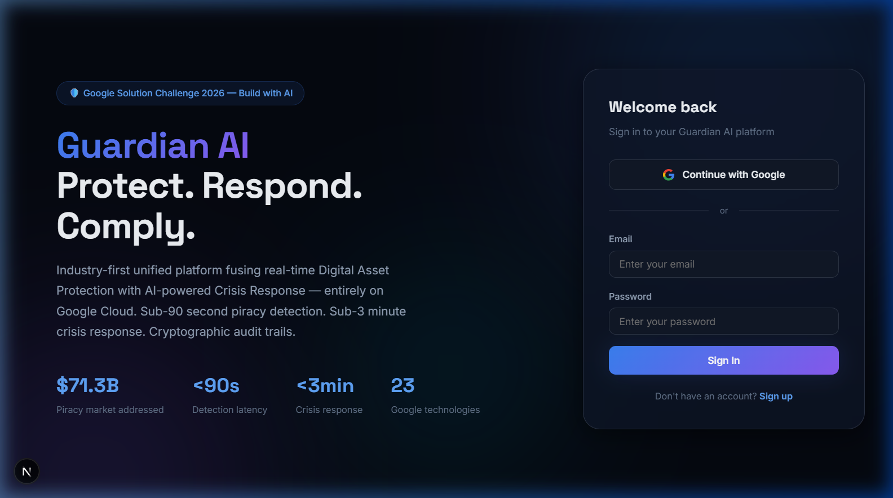
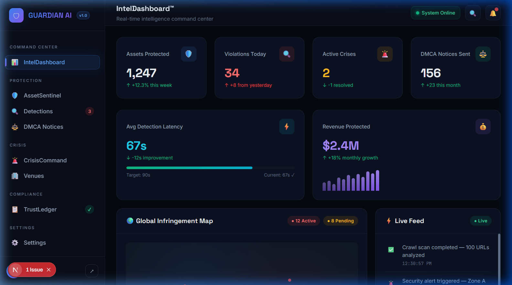
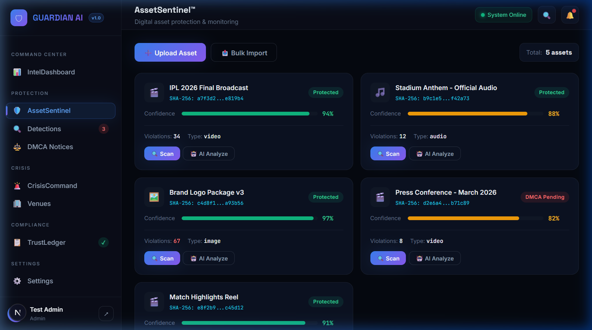
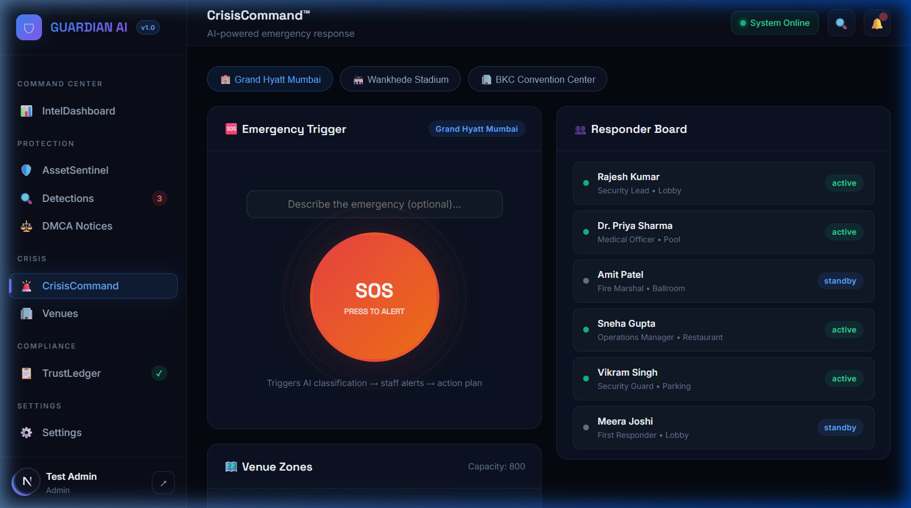
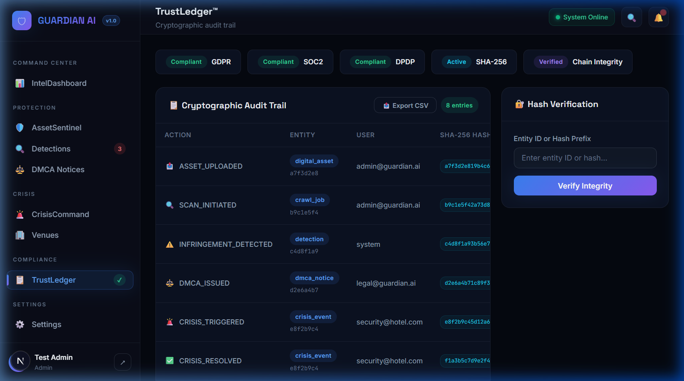

<p align="center">
  
  
  
  
  
</p>

<h1 align="center">🛡️ GUARDIAN AI</h1>
<h3 align="center">Real-Time Digital Asset Protection & Intelligent Crisis Response Platform</h3>

<p align="center">
  <strong>The industry-first unified platform that fuses real-time Digital Asset Protection with AI-powered Crisis Response — entirely on Google Cloud.</strong>
</p>

<p align="center">
  <a href="#-features">Features</a> •
  <a href="#-screenshots">Screenshots</a> •
  <a href="#%EF%B8%8F-tech-stack">Tech Stack</a> •
  <a href="#-getting-started">Getting Started</a> •
  <a href="#-architecture">Architecture</a> •
  <a href="#-modules">Modules</a> •
  <a href="#-deployment">Deployment</a> •
  <a href="#-contributing">Contributing</a>
</p>

---

## 🎯 The Problem

| Digital Asset Piracy | Crisis Response |
|---|---|
| $12B+ lost annually to unauthorized content distribution across platforms like Telegram, YouTube, TikTok, and the Dark Web | Emergency response in large venues is fragmented — fire, medical, and security incidents lack unified AI-driven coordination |
| **No unified platform** tracks media propagation across the open web AND coordinates response in real-time | Existing solutions are siloed, expensive, and don't leverage AI for instant classification and action plan generation |

**Guardian AI** is the only solution that solves **both problems** in one integrated intelligence layer.

---

## ✨ Features

### 🛡️ Digital Asset Protection
- **Perceptual Hashing** — SHA-256 cryptographic fingerprinting for every uploaded asset
- **Cross-Platform Scanning** — Simultaneous crawl across YouTube, Telegram, X/Twitter, TikTok, Dailymotion, Reddit, and Dark Web
- **AI-Powered Analysis** — Gemini AI classifies content, assesses protection priority, and identifies key features
- **Automated DMCA Generation** — One-click legally-formatted DMCA takedown notices via Gemini AI

### 🚨 Crisis Response
- **SOS Emergency Trigger** — One-button emergency activation with AI crisis classification
- **Responder Coordination** — Real-time responder board with role-based status tracking
- **AI Action Plans** — Gemini generates step-by-step response protocols based on crisis type
- **Multi-Venue Management** — Configure zones, capacities, and responder assignments per venue

### 📋 Compliance & Audit
- **TrustLedger™** — Immutable cryptographic audit trail with SHA-256 hash chain verification
- **Compliance Badges** — GDPR, SOC2, DPDP, ISO 27001 compliance tracking
- **CSV Export** — Full audit log export for regulatory submissions

### 🏢 Enterprise Suite
- **Autonomous Zero-Touch Enforcement** — Rule-based interceptor logically evaluates threats and dispatches DMCAs autonomously when risk thresholds are met.
- **Predictive Threat Forecasting** — Geospatial pre-crime mapping projecting anomalies based on historical AI swarm generation paths.

### 📊 Intelligence Dashboard
- **Real-Time KPIs** — Assets protected, violations detected, active crises, DMCA success rates
- **Live Event Feed** — Auto-updating stream of platform events (detections, scans, alerts)
- **Platform Analytics** — Violation distribution across 7+ platforms with visual breakdowns
- **Crisis Response Metrics** — SLA tracking for fire, medical, security, and evacuation response times

---

## 📸 Screenshots

<details>
<summary><strong>🏠 Landing Page — Premium Auth Experience</strong></summary>
<br />

<p><em>Animated hero section with glassmorphism login form, Google Sign-In, and real-time statistics</em></p>
</details>

<details open>
<summary><strong>📊 IntelDashboard™ — Command Center</strong></summary>
<br />

<p><em>6 KPI cards, global infringement map, live event feed, platform violation bars, and crisis response times</em></p>
</details>

<details>
<summary><strong>🛡️ AssetSentinel™ — Asset Protection</strong></summary>
<br />

<p><em>Asset cards with SHA-256 hashes, confidence scores, platform scan triggers, and AI analysis</em></p>
</details>

<details>
<summary><strong>🚨 CrisisCommand™ — Emergency Response</strong></summary>
<br />

<p><em>SOS trigger button, responder board with status indicators, venue zones, and AI crisis classification</em></p>
</details>

<details>
<summary><strong>📋 TrustLedger™ — Cryptographic Audit</strong></summary>
<br />

<p><em>Immutable audit trail with hash chain verification, compliance badges, and CSV export</em></p>
</details>

---

## 🛠️ Tech Stack

| Layer | Technology | Purpose |
|---|---|---|
| **Framework** | Next.js 16 (App Router) | Server-side rendering, route groups, file-based routing |
| **UI** | React 19 + Custom CSS | Glassmorphism design system with micro-animations |
| **Auth** | Firebase Authentication | Email/Password + Google Sign-In with session persistence |
| **Database** | Cloud Firestore | Real-time NoSQL database with security rules |
| **Storage** | Firebase Cloud Storage | Asset file storage with CDN delivery |
| **AI Engine** | Gemini API (`@google/generative-ai`) | Content analysis, DMCA generation, crisis classification |
| **Cryptography** | Web Crypto API | SHA-256 hashing for TrustLedger audit trail |
| **Hosting** | Firebase Hosting | CDN-backed global deployment |
| **Maps** | Leaflet + react-leaflet | Global infringement visualization |
| **Charts** | Chart.js + react-chartjs-2 | Platform analytics and trend visualization |

---

## 🚀 Getting Started

### Prerequisites

- **Node.js** 18+ ([Download](https://nodejs.org/))
- **npm** 9+ (comes with Node.js)
- **Firebase Account** ([Create one free](https://console.firebase.google.com/))
- **Gemini API Key** ([Get from AI Studio](https://aistudio.google.com/apikey))

### 1. Clone the Repository

```bash
git clone https://github.com/abdul05kh/guardian-ai.git
cd guardian-ai
```

### 2. Install Dependencies

```bash
npm install
```

### 3. Configure Environment Variables

Create a `.env.local` file in the root directory:

```env
# Firebase Configuration (from Firebase Console → Project Settings)
NEXT_PUBLIC_FIREBASE_API_KEY=your_firebase_api_key
NEXT_PUBLIC_FIREBASE_AUTH_DOMAIN=your_project.firebaseapp.com
NEXT_PUBLIC_FIREBASE_PROJECT_ID=your_project_id
NEXT_PUBLIC_FIREBASE_STORAGE_BUCKET=your_project.firebasestorage.app
NEXT_PUBLIC_FIREBASE_MESSAGING_SENDER_ID=your_sender_id
NEXT_PUBLIC_FIREBASE_APP_ID=your_app_id

# Gemini AI (from aistudio.google.com)
NEXT_PUBLIC_GEMINI_API_KEY=your_gemini_api_key
```

<details>
<summary><strong>📖 How to get these values</strong></summary>

#### Firebase Config
1. Go to [Firebase Console](https://console.firebase.google.com/)
2. Create a new project (or use existing)
3. Click ⚙️ **Project Settings** → **General**
4. Scroll down to **Your apps** → Click **Web** (</>) icon
5. Register your app and copy the `firebaseConfig` values

#### Gemini API Key  
1. Go to [Google AI Studio](https://aistudio.google.com/apikey)
2. Click **Create API Key**
3. Copy the key to your `.env.local`

#### Firebase Services to Enable
- **Authentication** → Sign-in method → Enable **Email/Password** and **Google**
- **Firestore Database** → Create database → Start in production mode
- **Storage** → Get started → Set up default bucket

</details>

### 4. Run the Development Server

```bash
npm run dev
```

Open [http://localhost:3000](http://localhost:3000) in your browser.

### 5. Create Your First Account

1. Click **"Create Account"** on the landing page
2. Enter your name, email, and password
3. You'll be redirected to the **IntelDashboard™**

---

## 🏗️ Architecture

```
guardian-ai/
├── app/                          # Next.js App Router
│   ├── layout.js                 # Root layout (AuthProvider wrapper)
│   ├── page.js                   # Landing page + Auth (login/signup)
│   ├── globals.css               # Complete design system (1200+ lines)
│   └── (protected)/              # Route group — all authenticated pages
│       ├── layout.js             # Shared sidebar + header + auth guard
│       ├── dashboard/page.js     # IntelDashboard™
│       ├── assets/page.js        # AssetSentinel™
│       ├── crisis/page.js        # CrisisCommand™
│       ├── audit/page.js         # TrustLedger™
│       ├── detections/page.js    # Infringement Detections
│       ├── dmca/page.js          # DMCA Notice Management
│       ├── venues/page.js        # Venue Management
│       └── settings/page.js      # Platform Settings
├── components/
│   ├── Sidebar.js                # Navigation sidebar with active states
│   └── Header.js                 # Page header with system status
├── lib/
│   ├── firebase.js               # Firebase SDK initialization
│   ├── auth-context.js           # Auth state management (React Context)
│   ├── gemini.js                 # Gemini AI gateway (all AI calls)
│   └── crypto.js                 # SHA-256 hashing (Web Crypto API)
├── firestore.rules               # Firestore security rules
├── firebase.json                 # Firebase deployment config
└── public/screenshots/           # App screenshots
```

### Design Decisions

| Decision | Rationale |
|---|---|
| **Route Groups `(protected)/`** | Single auth guard + sidebar/header instance — prevents re-rendering on navigation |
| **CSS Variables (no Tailwind)** | Full design system control, smaller bundle, premium glassmorphism effects |
| **Gemini Gateway Pattern** | All AI calls through `lib/gemini.js` — swap models without touching pages |
| **Web Crypto API** | Browser-native SHA-256, no dependencies, TrustLedger immutability |
| **Fallback Auth Profile** | If Firestore is offline, auth context uses Firebase Auth data as fallback |

---

## 📦 Modules

### IntelDashboard™ (`/dashboard`)
Real-time command center with 6 KPI cards, auto-updating event feed (new events every 4-7 seconds), global infringement map with pulsing violation markers, platform-level violation distribution, and crisis response SLA tracking.

### AssetSentinel™ (`/assets`)
Digital asset protection hub. Upload media files (video, audio, image, document) with automatic SHA-256 fingerprinting. Trigger cross-platform scans across 7 platforms. Run AI analysis via Gemini for content classification, protection priority, and uniqueness scoring.

### CrisisCommand™ (`/crisis`)
AI-powered emergency response. Select venues, describe emergencies, and trigger SOS alerts. Gemini AI classifies crisis severity and generates action plans. Real-time responder board tracks personnel status and zone assignments. Supports multi-venue configurations.

### TrustLedger™ (`/audit`)
Immutable cryptographic audit trail. Every platform action is logged with SHA-256 hashes forming a verifiable chain. Supports hash integrity verification, compliance badge tracking (GDPR, SOC2, DPDP, ISO 27001), and CSV export for regulatory submissions.

### Detections (`/detections`)
Infringement tracking table with confidence scores, detection methods (perceptual hash, Vertex Vision, audio fingerprint), revenue-at-risk calculations, and one-click DMCA notice generation via Gemini AI.

### Threat Network (`/threat-network`)
Deep Research Intelligence module utilizing an autonomous multi-agent swarm to construct ForceGraph projections of piracy clusters and generate Fiedler eigenvalue threat scores. 

### Predictive Forecast (`/forecast`)
Geospatial Threat Mapping dashboard visualizing pre-crime vulnerability indexes and predicting incoming digital asset infringement vectors prior to exploitation utilizing SVG map rendering.

### Enforcement Policies (`/policies`)
Enterprise rule-set configuration allowing admins to set minimum confidence and revenue loss thresholds that automatically circumvent human evaluation queues and trigger real-time zero-touch autonomous DMCA notifications.

### Settings (`/settings`)
Platform configuration: user profile editing, Gemini API key management, scan frequency settings, and Google Cloud service integration status monitoring.

---

## 🌐 Deployment

### Firebase Hosting (Recommended)

```bash
# 1. Install Firebase CLI
npm install -g firebase-tools

# 2. Login to Firebase
firebase login

# 3. Build the production bundle
npm run build

# 4. Deploy to Firebase Hosting
firebase deploy --only hosting
```

Your app will be live at `https://your-project-id.web.app`

### Deploy Firestore Rules

```bash
firebase deploy --only firestore:rules
```

### Environment Variables for Production

Set your environment variables in your hosting environment. For Firebase Hosting, use the `.env.local` file during build time:

```bash
# Build with environment variables
NEXT_PUBLIC_GEMINI_API_KEY=your_key npm run build
```

---

## 💰 Cost Optimization

Guardian AI is architected for the **Google Cloud free tier**, minimizing operational costs:

| Service | Free Tier Limit | Guardian AI Usage |
|---|---|---|
| Firebase Auth | 10K verifications/month | ✅ Well within limit |
| Firestore | 1 GiB storage, 50K reads/day | ✅ Optimized queries |
| Cloud Storage | 5 GB storage | ✅ Asset fingerprints |
| Firebase Hosting | 10 GB transfer/month | ✅ Static + SSR |
| Gemini API | 15 RPM free tier | ✅ On-demand AI calls |

**Estimated monthly cost: ₹0 - ₹100** (within free tier for typical startup usage)

---

## 🔒 Security

- **Authentication**: Firebase Auth with session persistence and automatic token refresh
- **Authorization**: Firestore security rules enforce per-user data isolation
- **Encryption**: SHA-256 cryptographic hashing for audit trail integrity
- **XSS Protection**: React's built-in DOM sanitization + Next.js CSP headers
- **CORS**: Firebase Hosting default CORS configuration

### Firestore Security Rules

```javascript
rules_version = '2';
service cloud.firestore {
  match /databases/{database}/documents {
    // Users can only read/write their own profile
    match /users/{userId} {
      allow read, write: if request.auth != null && request.auth.uid == userId;
    }
    // Authenticated users can access platform data
    match /{collection}/{document=**} {
      allow read, write: if request.auth != null;
    }
  }
}
```

---

## 🤝 Contributing

Contributions are welcome! Please follow these steps:

1. **Fork** the repository
2. **Create** a feature branch (`git checkout -b feature/amazing-feature`)
3. **Commit** your changes (`git commit -m 'Add amazing feature'`)
4. **Push** to the branch (`git push origin feature/amazing-feature`)
5. **Open** a Pull Request

### Development Guidelines

- Use the existing CSS design system (CSS variables in `globals.css`)
- All AI calls go through `lib/gemini.js` — never call Gemini directly from pages
- Follow the route group pattern — new authenticated pages go in `app/(protected)/`
- Maintain the glassmorphism dark theme aesthetic

---

## 📄 License

This project is licensed under the MIT License — see the [LICENSE](LICENSE) file for details.

---

## 👥 Team — Void Breakers

Built for **Google Solution Challenge 2026 — Build with AI**

| Role | Responsibility |
|---|---|
| **Full-Stack Developer** | Next.js architecture, Firebase integration, Gemini AI gateway |
| **UI/UX Designer** | Glassmorphism design system, micro-animations, responsive layouts |
| **Security Engineer** | Cryptographic hashing, Firestore security rules, audit trail |

---

## 🙏 Acknowledgements

- [Google Solution Challenge 2026](https://developers.google.com/community/gdsc-solution-challenge) — Build with AI
- [Firebase](https://firebase.google.com/) — Authentication, Firestore, Storage, Hosting
- [Gemini AI](https://ai.google.dev/) — Content analysis, DMCA generation, crisis classification
- [Next.js](https://nextjs.org/) — React framework for production
- [Hack2Skill](https://hack2skill.com/) × [GDG on Campus](https://developers.google.com/community/gdg) — Platform support

---

<p align="center">
  <strong>🛡️ Guardian AI — Protecting digital assets. Saving lives. Powered by Google AI.</strong>
</p>
